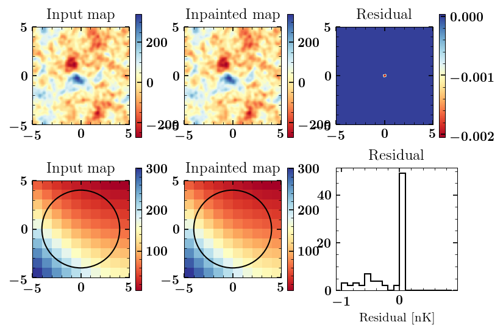

# Inpainting
## [readthedocs-documentation](https://inpainting.readthedocs.io/en/latest/index.html)

## Code for CMB inpainting

### Eliminating SZ-induced bias in CMB(-cluster) lensing reconstruction.
This code was originally developed to modify the standard CMB (cosmic microwave background) lensing quadratic estimator (QE) used to reconstruct the lensing of the CMB by galaxy clusters --**inpainted gradient QE**--. Reference: **arXiv: [1904.13392](https://arxiv.org/abs/1904.13392).**

QE recontructs the underlying lensing potential using the correlation between large- and small-scale CMB at a given location on the sky. This is achieved using two maps (or a single map) filtered optimally to extract the large- and small-sclae informations. In an ideal world, in the absence of foregrounds and other non-primordial Gaussianites, lensing is the only process that introduces such a correlation between large- and small-scales. However, in the real world foregrounds, especially cluster Sunyaev Zeldovich (SZ), both thermal (tSZ) and kinematic (kSZ), also induce a similar correlation which contaminates the lensing reconstruction. 

Inpainting the CMB at the cluster location in the map filtered to extract the large-scale CMB gradient removes the SZ contamination in that map and hence eliminates SZ-induced lensing bias. **More details can be found in arXiv: [1904.13392](https://arxiv.org/abs/1904.13392).**

